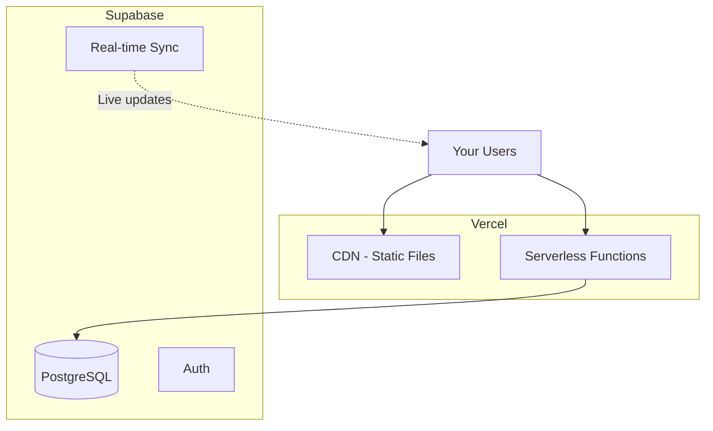
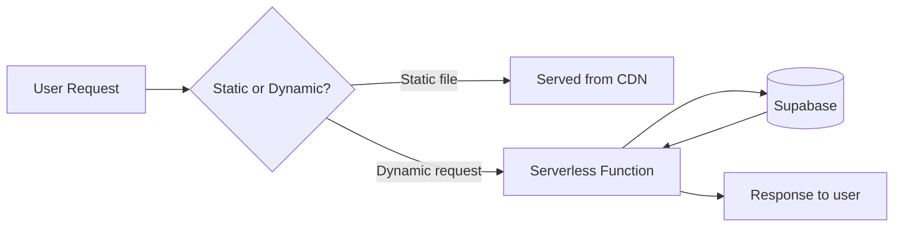
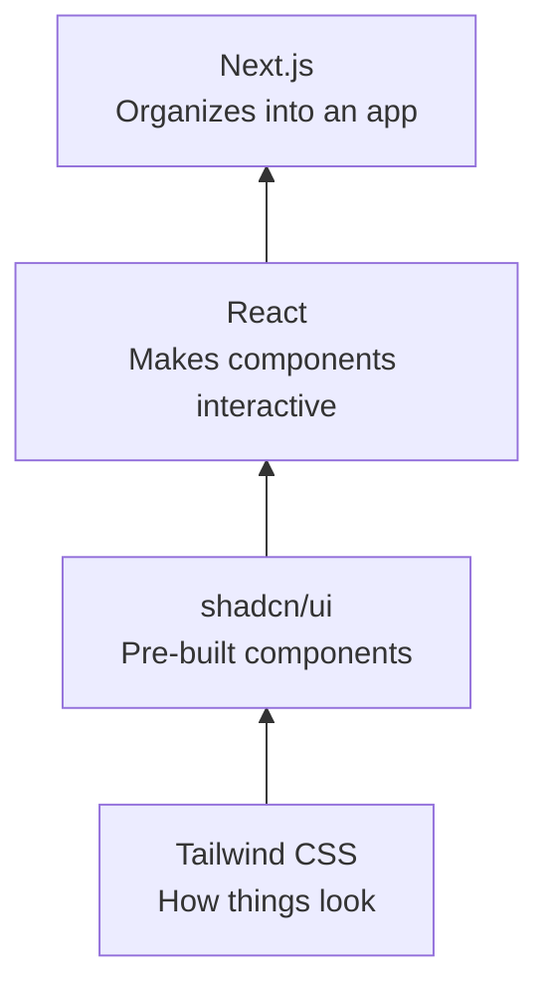
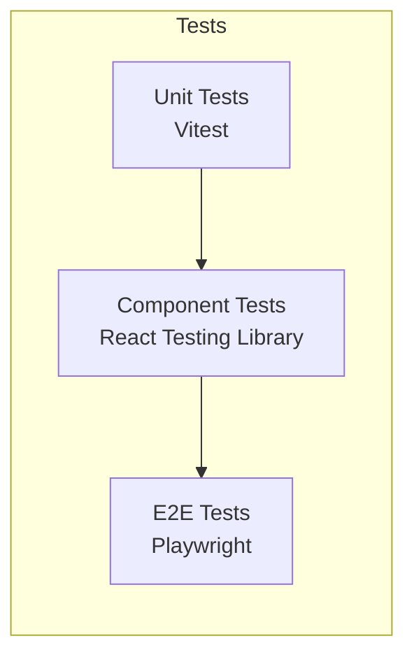
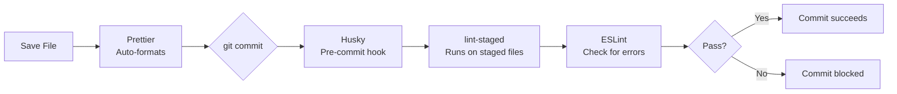

# Tech Stack Recommendations

These are reference stacks for common project types. Use during `/scaffold` when making infrastructure decisions. Not prescriptive — adapt to your needs.

## Web Application (Default Recommendation)

### Backend

| Function           | Tech                  | Description                                      |
| ------------------ | --------------------- | ------------------------------------------------ |
| Hosting / Deploy   | Vercel                | Runs your app, handles deploys via git push      |
| CDN (static files) | Vercel (built-in)     | Serves images/CSS/JS fast from servers worldwide |
| Database           | Supabase (PostgreSQL) | Stores your data in tables                       |
| ORM                | Drizzle               | Write database queries in TypeScript, not SQL    |
| Real-time sync     | Supabase              | Push live updates to users without refresh       |
| Auth               | Supabase Auth         | Login, signup, sessions, passwords               |
| File storage       | Supabase Storage      | Upload/download files (images, PDFs, etc.)       |

**Real-time sync:** Changes made by one user are instantly pushed to all connected clients - no refresh needed. Useful for collaborative tools, live dashboards, or calculators where multiple users see updates instantly.

**Cost:**

| Component    | Running                      | You Pay                   |
| ------------ | ---------------------------- | ------------------------- |
| **Vercel**   | On-demand                    | Per request + bandwidth   |
| **Supabase** | Always (free tier available) | Database size + bandwidth |

### Frontend

| Function         | Tech                  | Description                                                   |
| ---------------- | --------------------- | ------------------------------------------------------------- |
| Framework        | Next.js               | Organizes your app - routing, pages, API endpoints            |
| UI rendering     | React                 | Turns components into what users see in the browser           |
| Language         | TypeScript            | JavaScript with types - catches errors before runtime         |
| Styling          | Tailwind + OKLCH      | CSS utility classes + perceptually uniform colors             |
| React Components | shadcn/ui             | Pre-built buttons, forms, modals - copy into project          |
| Data fetching    | TanStack Query        | Handles API calls, caching, loading states for you            |
| Client state     | Zustand               | Lightweight state management when TanStack Query isn't enough |
| Forms            | React Hook Form + Zod | Form handling with schema validation                          |

## Project-Specific Additions

### Web Scraping

| Function       | Tech     | Description                                                      |
| -------------- | -------- | ---------------------------------------------------------------- |
| Web scraping   | Cheerio  | Fast, lightweight HTML parsing for static content                |
| HTTP requests  | Axios    | Make requests to dineoncampus.com and handle responses           |
| Cron jobs      | Vercel Cron | Scheduled scraping to keep menu data fresh (runs daily/hourly) |

**Why Cheerio over Puppeteer/Playwright:** If dineoncampus.com serves static HTML, Cheerio is 10x faster and simpler. Only switch to Playwright if the site requires JavaScript rendering.

### LLM Integration

| Function           | Tech                    | Description                                              |
| ------------------ | ----------------------- | -------------------------------------------------------- |
| LLM API            | OpenAI API (GPT-4)      | Generate meal recommendations based on user preferences  |
| Prompt management  | Direct string templates | Simple prompts for now - can upgrade to LangChain later  |
| Response parsing   | Zod                     | Validate LLM responses match expected schema             |

**Alternative:** Anthropic Claude API if you prefer Claude over GPT-4.

### Caching & Data Strategy

| Function              | Tech                          | Description                                                  |
| --------------------- | ----------------------------- | ------------------------------------------------------------ |
| Menu item cache       | Supabase PostgreSQL           | Store scraped items with nutrition, dietary tags             |
| Session cache         | TanStack Query                | Cache LLM responses client-side to avoid redundant API calls |
| Scraping deduplication | PostgreSQL unique constraints | Prevent duplicate menu items in database                     |

**Caching flow:**
1. Scrape menu → Check if item exists in DB by name
2. If exists: use cached nutrition data
3. If new: parse nutrition, save to DB
4. LLM queries use DB data, not live scraping

## Development

### Testing

| Layer     | What It Tests                          | Tool                  |
| --------- | -------------------------------------- | --------------------- |
| Unit      | Domain logic, utilities, pure functions | Vitest                |
| Component | React components in isolation          | React Testing Library |
| E2E       | Full app in browser (acceptance criteria) | Playwright         |

### Dev Tooling

| Function           | Tool        | Description                                         |
| ------------------ | ----------- | --------------------------------------------------- |
| Linting            | ESLint      | Catches code problems - like spell-check for code   |
| Formatting         | Prettier    | Auto-formats code on save (tabs, quotes, etc.)      |
| Pre-commit hooks   | Husky       | Runs checks before git commit is allowed            |
| Staged file checks | lint-staged | Only checks files you're committing - keeps it fast |

---

## Changelog

**v1.0 (2025-12-05)**
- Initial extraction from README.md
- Added artifact frontmatter
